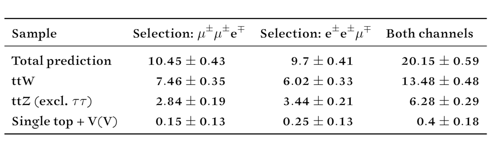

# High-purity ttW measurement feasibility study

Stefan Richter (DESY)

---

This is a simple feasibility study for measuring ttW production in a high-purity (but low-branching) channel,

$$t\bar{t}W^{\pm} \to \ell^{\pm}\ell^{\pm}\ell'^{\mp} b \bar{b} \mbox{ + neutrinos}$$

## Strategy

Estimate the yields after a simple signal selection using MC for the known processes that can contribute without a misidentified lepton (including charge mismeasurement). Only MC16e samples are run (corresponding to 2018 data) to speed things up, although the other subcampaigns can be added quite quickly.

`AnalysisTop 21.2.90` is used.

## Event selection

* Exactly two tight leptons with $$p_{\mathrm{T}} >$$ 27 GeV of the same flavour (e or µ) with the same charge ($$\pm$$)
* Exactly one tight lepton with $$p_{\mathrm{T}} >$$ 27 GeV of the other flavour (µ or e) with the opposite charge ($$\mp$$)
* Two or more jets with $$p_{\mathrm{T}} >$$ 27 GeV
* Both jets b-tagged (77% efficiency working point)
<!--* One lepton has $$p_{\mathrm{T}} >$$ 27 GeV (to match the single lepton triggers currently used — but should trigger on multiple leptons!)
-->

There is no requirement on jets. This has the advantage of keeping the experimental uncertainties much smaller.

## Results

Here are yields predictions and some kinematic distributions, scaled to the total Run 2 luminosity.

## Discussion

### Caveats

Need to add modelling of triboson processes (WWW!) and ttZ($$\to \tau\tau$$).

<!--In particular, the current signal process without jet selection equally selects leading-order $$W^{\pm}W^{\pm}W^{\mp}$$ production without any heavy-flavour involvement (top or bottom). Perhaps the two could be measured together and then an interpretation made in terms of the "ttW" and "WWW" separation.
-->
### Selection optimisation

* The $$p_{\mathrm{T}}$$ distribution of the softest lepton suggests that not much signal acceptance can be gained by cutting looser on the lepton $$p_{\mathrm{T}}$$. Still, should try looser cuts
* Probably should use much more loosely identified leptons to enhance the signal acceptance
* Could use charge ID tool to reject electrons with uncertain charge measurement (if the efficiency is high enough).
* Could loosen the cut on the number of b-jets to gain signal acceptance

### Conclusion

With looser lepton and (b-)jet cuts, this region could be used for a relatively robust measurement modelling-wise with a large statistical uncertainty of less than 20%. The current selection reaches around 25%.
